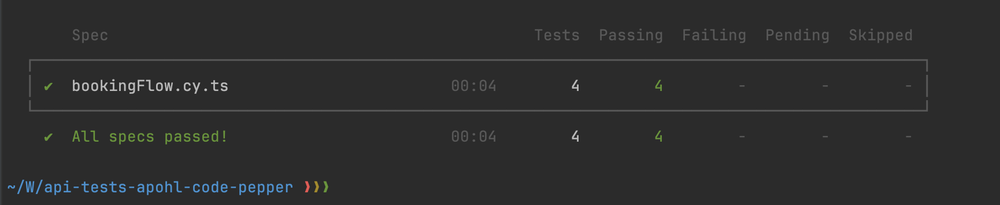

### API Tests for Code & Pepper by APOHL

API Tests that verify if booking can be created, updated and deleted 

## Prerequisite

- Ensure you have Node installed

## Install

- `npm install` - install dependencies

## Important

By default application will run on `https://restful-booker.herokuapp.com/`

## Run Cypress with GUI

- `npx cypress open`

## Run Cypress headless in Electron

- `npm run cy:run`
- `npx cypress run --e2e --spec "cypress/e2e/bookingFlow.cy.ts"`

## Run Cypress headless in other browsers than Electron

- `npm run cy:run:chrome`
- `npm run cy:run:firefox`
- `npm run cy:run:edge`

### Test results

